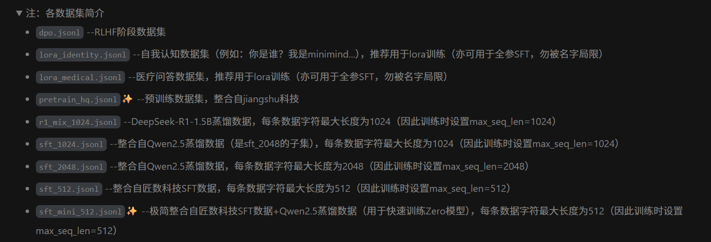

# function of dataset
### author:xwl777
### last update:2026/1/31
---

./dataset/  
├── dpo.jsonl (55MB)  
├── lora_identity.jsonl (22.8KB)  
├── lora_medical.jsonl (34MB)  
├── pretrain_hq.jsonl (1.6GB, ✨)  
├── r1_mix_1024.jsonl (340MB)  
├── sft_1024.jsonl (5.6GB)  
├── sft_2048.jsonl (9GB)  
├── sft_512.jsonl (7.5GB)  
└── sft_mini_512.jsonl (1.2GB, ✨)
1. **jsonl**  
   *  jsonl格式每一行都是一个json对象，因此可以很方便的用python迭代器一次读取一个json对象。用```json.loads()```方法可以把json对象转化为一个字典如{"text": "..."}。

2. **Dataset类**
   * 继承Dataset类的子类必须实现```__len__（）```和```__getitem__（index）```两个方法。```__len__（）```返回数据集的大小，```__getitem__（index）```根据索引从数据集中取出对象。
   * minimind的```__getitem__（index）```方法返回一个三元组（X,Y,loss_mask）。假设一个句子seq由n个token组成，X为seq[:-1],Y为seq[1：]。loss_mask是一个损失掩码，因为对于长度未达到max_length的句子我们会填充PAD字符，同时不希望PAD字符对应的位置被计入损失以免干扰模型训练，因此需要loss_mask来屏蔽PAD位置的损失。

3. **SFTDataset**  
   *  ```
      {
         "conversations": [
            {"role": "user", "content": "1+1=?"},
            {"role": "assistant", "content": "2"}
         ]
      }
      ```
      SFT数据集的结构如上所示。

      应用chat_template可以把这种格式的字典转化为纯文本。关键在于构建出loss_mask，使损失只关注assistant回答的部分。只需要确认bos_id和eos_id，在bos_id之后即为assistant说话的内容，在eos_id即为assistant说话的结束。在一段conversation文本中找出所有bos和eos之间的内容即可。

