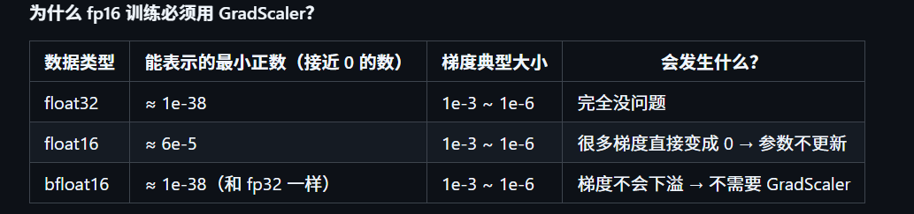

# basic trainer
### author:xwl777
### last update:2026/1/13
---
训练部分其实比较陌生，能记的东西也挺多的，一点一点慢慢写吧

1. **混合精度训练**  
   * 在深度学习中，电脑存数字通常用 FP32 (32位浮点数)，相比FP16更精确，但占内存大（4字节），计算慢。后来人们发现，训练神经网络其实不需要那么精确，用 FP16 (16位浮点数)就够了。这样显存占用减半（能跑更大的 Batch Size），计算速度快。但FP16数字太小容易变成 0（下溢出），或者数字太大存不下（上溢出），导致训练崩溃。混合精度就是结合了两者的优点，PyTorch 会自动判断，哪些算术（比如矩阵乘法）用 FP16 算，哪些算术（比如累加 Loss）用 FP32 算。 
   * bfloat16: Google 搞出来的“大脑浮点数”，范围和 FP32 一样大，只是精度低。它更不容易报错，训练更稳，但只有较新的显卡（如 3090, 4090, A100）才支持。
   * ```torch.cuda.amp.autocast()```是一个用于实现混合精度的类。例如：
     ``` 
     autocast_ctx = torch.cuda.amp.autocast(dtype = dtype)
     with autocast_ctx:
            res = model(X, logits_to_keep=0)
            loss = loss_fct(
                res.logits.view(-1, res.logits.size(-1)),
                Y.view(-1)
            ).view(Y.size())

            loss = (loss * loss_mask).sum() / loss_mask.sum()
            loss += res.aux_loss
            loss = loss / args.accumulation_steps
     ```
        在with缩进内的语句自动进行混合精度训练
2. **scaler**  
   * 
   * ```
        scaler = GradScaler(enabled=(args.dtype == 'float16'))   # 只有 fp16 时才启用

        with torch.cuda.amp.autocast(enabled=(args.dtype != 'float32')):
            loss = model(input)

        scaler.scale(loss).backward() # 在反向传播（Backward）之前，scaler 会把 Loss 乘以一个很大的数,保证梯度不消失

        scaler.unscale_(optimizer) # 将梯度放缩回来，这是为了下一步梯度裁剪做准备；如果不进行梯度裁剪，可以直接进行scaler.step(optimizer)，这会在内部自动unscale

        torch.nn.utils.clip_grad_norm_(model.parameters(), args.grad_clip) # 梯度裁剪，防止梯度爆炸。没办法处理inf。

        scaler.step(optimizer) # 先 unscale 梯度
                               # 检查梯度里有无 inf/NaN
                               # 如果有 inf/NaN → 跳过 optimizer.step()
                               # 如果没有 → 正常更新参数

        scaler.update()        # 根据这次是否出现 inf/NaN
                               # 自动增大或减小下一次的 scale 值
        optimizer.zero_grad()
     ```

3. **梯度累积**
   1. batch：指用整个数据集更新一次参数。显然消耗大量显存，而且速度慢。
   2. Stochastic：用一个sample更新一次参数。不稳定，受异常数据干扰严重。
   3. Minibatch：用一批数据更新一次参数  
    我们讨论的batch_size其实是minibatch_size
    
    假设理想的batch_size = 32，即准备使用32个samples更新一次数据。当显存有限，一次无法装进一个batch的数据时，可以使用梯度累积。一次装入8笔数据，进行4次，4次的损失取平均更新一次参数。  
    梯度累积消耗了更多的时间，换来跑大batch的能力。

4. **tokenizer**
   * 分词器把token映射到对应的唯一id，最常见的算法是BPE，它基于统计，把经常相邻出现的字符组合合并成一个 Token。
   * 在 transformers 库中，我们主要打交道的是以下两个类  
     * AutoTokenizer：你只需要给它一个模型路径（比如 "Qwen/Qwen2.5-7B"），它会自动分析 config.json，然后帮你加载出对应架构的分词器类。
     ```
        from transformers import AutoTokenizer  
        tokenizer = AutoTokenizer.from_pretrained("path/to/model")
     ``` 
     * PreTrainedTokenizerFast：这是大多数现代 Tokenizer 的基类（基于 Rust 编写的 tokenizers 库，速度极快）。包含内容：
       * Vocab (词表): 字典，记录了 苹果 -> 123 的映射。
       * Special Tokens: 特殊符号，如 <|endoftext|> (结束), <|im_start|> (对话开始)。
       * Chat Template: 也就是 apply_chat_template，定义了对话是如何拼接的（User/Assistant 格式）。
   * tokenizer的训练：一个训练好的tokenizer包含两个文件，tokenizer.json和tokenizer_config.json。如果决定自己训练一个tokenizer，流程如下：
```
import json
import os
from tokenizers import models, normalizers, pre_tokenizers, trainers, Tokenizer, decoders
from transformers import PreTrainedTokenizerFast

def train_tokenizer():
    # 1. 初始化 BPE 模型
    tokenizer = Tokenizer(models.BPE())
    
    # 2. 设置不进行特殊的预处理（保留原始文本格式）
    tokenizer.pre_tokenizer = pre_tokenizers.ByteLevel(add_prefix_space=False)
    tokenizer.decoder = decoders.ByteLevel()

    # 3. 定义训练器
    trainer = trainers.BpeTrainer(
        vocab_size=6400,  # 这里的词表大小决定了模型 Embedding 层的大小
        special_tokens=["<|endoftext|>", "<|im_start|>", "<|im_end|>"],
        show_progress=True
    )

    # 4. 数据生成器（流式读取，防 OOM）
    def batch_iterator():
        path = "../dataset/pretrain_hq.jsonl"
        with open(path, "r", encoding="utf-8") as f:
            for i, line in enumerate(f):
                if i > 500000: break # 采样前50万行即可
                try:
                    text = json.loads(line).get("text", "")
                    if text: yield text
                except: continue

    # 5. 开始训练
    tokenizer.train_from_iterator(batch_iterator(), trainer=trainer)

    # 6. 保存并转换为 Transformers 格式
    save_path = "../model/minimind_tokenizer"
    os.makedirs(save_path, exist_ok=True)
    
    # 这里很关键：把训练好的底层 tokenizer 包装成 transformers 能认的类
    fast_tokenizer = PreTrainedTokenizerFast(
    tokenizer_object=tokenizer,          # 传入训练好的实体
    tokenizer_file=None,                 # 设为None，强制它保存新文件
    bos_token="<|im_start|>",
    eos_token="<|im_end|>",
    pad_token="<|endoftext|>",
    unk_token="<|endoftext|>",
    chat_template=chat_template_str,     # 【关键】把模板传进去！
    model_max_length=32768,              # 设定最大长度
    clean_up_tokenization_spaces=False   # 其他配置...
)
    fast_tokenizer.save_pretrained(save_path)
    print(f"训练完成！词表大小: {len(fast_tokenizer)}")
```  
采用PreTrainedTokenizerFast类会自动生成所需要的文件。minimind采用的事手动生成配置文件的方式，二者都是可行的。其中，chat_template是重要的参数。因为我们习惯用这种格式的代码来表示对话：
```
messages = [
    {"role": "user", "content": "你好"},
    {"role": "assistant", "content": "你好，我是AI"}
]
```
但是模型只能识别纯文本。chat_template 就是一段 Jinja2 代码（类似于网页模板），它定义了如何把上面的 messages 列表转换成下面的字符串（还有一些其他功能）。

5. **动态学习率**
   1. 

  